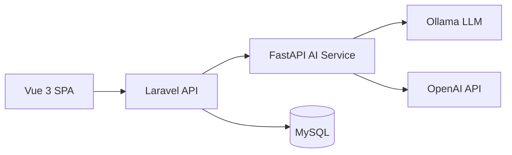
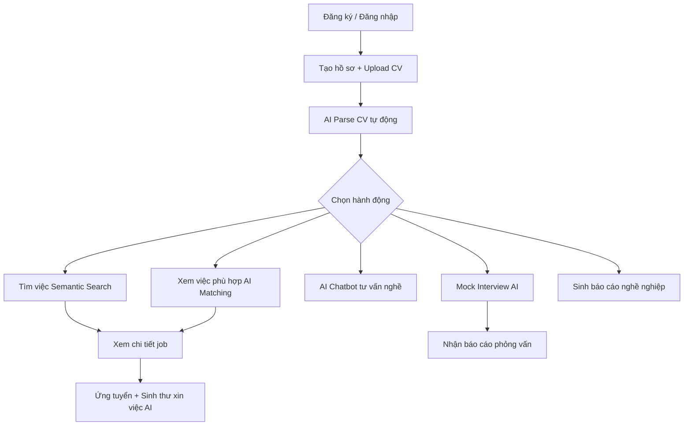
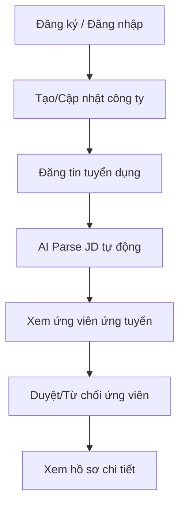
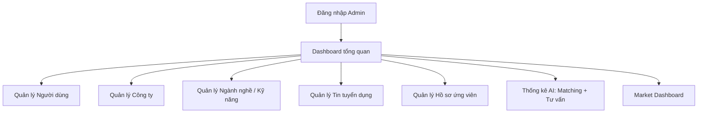

# 🔍 Phân Tích & Đánh Giá Hệ Thống SmartJob AI

## 1. Tổng Quan Kiến Trúc

Hệ thống SmartJob AI là **nền tảng tuyển dụng thông minh** với kiến trúc 3 tầng:

| Tầng | Công nghệ | Vai trò |
|------|-----------|---------|
| **BE** | Laravel (PHP) + Sanctum | API server, xác thực, điều phối nghiệp vụ |
| **FE** | Vue 3 + Vite | Giao diện SPA cho 3 vai trò: Ứng viên, NTD, Admin |
| **AI** | FastAPI (Python) | Xử lý CV/JD parsing, matching, chatbot, interview, semantic search |

---

## 2. Thống Kê Quy Mô

| Metric | Số lượng |
|--------|----------|
| Models (BE) | 19 |
| Migrations (DB) | 35 |
| API Controllers | 24 + 12 Admin = **36** |
| API Endpoints | **~100+** routes |
| FE Pages | **41** Vue components |
| FE Service functions | **~80+** API wrappers |
| AI Services | **10** service files |
| AI Routers | **7** router files |
| AI Providers | **9** provider files |
| AI Schemas | **8** schema files |

---

## 3. Bảng Đánh Giá Tính Năng Chi Tiết

### 3.1. Authentication & User Management

| Tính năng | BE | AI | FE Service | FE UI | Nối FE↔BE | Trạng thái |
|-----------|:--:|:--:|:----------:|:-----:|:---------:|:----------:|
| Đăng ký ứng viên | ✅ | — | ✅ | ✅ | ✅ | ✅ Hoàn chỉnh |
| Đăng nhập ứng viên | ✅ | — | ✅ | ✅ | ✅ | ✅ Hoàn chỉnh |
| Đăng ký NTD | ✅ | — | ✅ | ✅ | ✅ | ✅ Hoàn chỉnh |
| Đăng nhập NTD | ✅ | — | ✅ | ✅ | ✅ | ✅ Hoàn chỉnh |
| Đăng xuất | ✅ | — | ✅ | ✅ | ✅ | ✅ Hoàn chỉnh |
| Quên/Đặt lại mật khẩu | ✅ | — | ✅ | ✅ | ✅ | ✅ Hoàn chỉnh |
| Đổi mật khẩu | ✅ | — | ✅ | ✅ | ✅ | ✅ Hoàn chỉnh |
| Xem/Cập nhật hồ sơ cá nhân | ✅ | — | ✅ | ✅ | ✅ | ✅ Hoàn chỉnh |
| Route guard theo vai trò | ✅ | — | ✅ | ✅ | ✅ | ✅ Hoàn chỉnh |

### 3.2. Ứng Viên — Chức năng cốt lõi

| Tính năng | BE | AI | FE Service | FE UI | Nối FE↔BE | Trạng thái |
|-----------|:--:|:--:|:----------:|:-----:|:---------:|:----------:|
| Dashboard ứng viên | ✅ | — | ✅ | ✅ | ⚠️ | ⚠️ Cần kiểm tra nối dữ liệu thật |
| CRUD hồ sơ (CV) | ✅ | — | ✅ | ✅ | ✅ | ✅ Hoàn chỉnh |
| Upload file CV | ✅ | — | ✅ | ✅ | ✅ | ✅ Hoàn chỉnh |
| Quản lý kỹ năng cá nhân | ✅ | — | ✅ | ✅ | ✅ | ✅ Hoàn chỉnh |
| Lưu tin tuyển dụng | ✅ | — | ✅ | ✅ | ✅ | ✅ Hoàn chỉnh |
| Ứng tuyển việc làm | ✅ | — | ✅ | ✅ | ✅ | ✅ Hoàn chỉnh |
| Xem kết quả matching | ✅ | — | ✅ | ✅ | ✅ | ✅ Hoàn chỉnh |
| Xem báo cáo tư vấn nghề | ✅ | — | ✅ | ✅ | ✅ | ✅ Hoàn chỉnh |

### 3.3. Ứng Viên — Tính năng AI

| Tính năng | BE | AI | FE Service | FE UI | Nối FE↔BE | Trạng thái |
|-----------|:--:|:--:|:----------:|:-----:|:---------:|:----------:|
| Parse CV (AI) | ✅ | ✅ | ✅ | ✅ | ✅ | ✅ Hoàn chỉnh |
| Matching CV-JD | ✅ | ✅ | ✅ | ✅ | ✅ | ✅ Hoàn chỉnh |
| Sinh thư xin việc AI | ✅ | ✅ | ✅ | ✅ | ✅ | ✅ Hoàn chỉnh |
| Sinh báo cáo nghề nghiệp | ✅ | ✅ | ✅ | ✅ | ✅ | ✅ Hoàn chỉnh |
| AI Chatbot tư vấn nghề | ✅ | ✅ | ✅ | ✅ | ✅ | ✅ Hoàn chỉnh |
| AI Chatbot stream (SSE) | ✅ | ✅ | ✅ | ✅ | ✅ | ✅ Hoàn chỉnh |
| Mock Interview (AI phỏng vấn) | ✅ | ✅ | ✅ | ✅ | ✅ | ✅ Hoàn chỉnh |
| Mock Interview stream | ✅ | ✅ | ✅ | ✅ | ✅ | ✅ Hoàn chỉnh |
| AI Interview Report | ✅ | ✅ | ✅ | ✅ | ✅ | ✅ Hoàn chỉnh |
| Semantic Search việc làm | ✅ | ✅ | ✅ | ✅ | ✅ | ✅ Hoàn chỉnh |
| AI Center (hub trung tâm) | ✅ | — | ✅ | ✅ | ✅ | ✅ Hoàn chỉnh |

### 3.4. Nhà Tuyển Dụng

| Tính năng | BE | AI | FE Service | FE UI | Nối FE↔BE | Trạng thái |
|-----------|:--:|:--:|:----------:|:-----:|:---------:|:----------:|
| Dashboard NTD | ✅ | — | ✅ | ✅ | ⚠️ | ⚠️ Cần kiểm tra nối dữ liệu thật |
| CRUD tin tuyển dụng | ✅ | — | ✅ | ✅ | ✅ | ✅ Hoàn chỉnh |
| Parse JD (AI) | ✅ | ✅ | ✅ | ✅ | ✅ | ✅ Hoàn chỉnh |
| Quản lý công ty | ✅ | — | ✅ | ✅ | ✅ | ✅ Hoàn chỉnh |
| Xem hồ sơ ứng viên | ✅ | — | ✅ | ✅ | ✅ | ✅ Hoàn chỉnh |
| Duyệt ứng tuyển | ✅ | — | ✅ | ✅ | ✅ | ✅ Hoàn chỉnh |
| Quản lý phỏng vấn | ⚠️ | — | ⚠️ | ✅ | ⚠️ | ⚠️ UI có, BE không có lịch phỏng vấn riêng |

### 3.5. Admin

| Tính năng | BE | AI | FE Service | FE UI | Nối FE↔BE | Trạng thái |
|-----------|:--:|:--:|:----------:|:-----:|:---------:|:----------:|
| Dashboard admin | ✅ | — | ✅ | ✅ | ⚠️ | ⚠️ Cần kiểm tra nguồn dữ liệu thật |
| Quản lý người dùng | ✅ | — | ✅ | ✅ | ✅ | ✅ Hoàn chỉnh |
| Quản lý công ty | ✅ | — | ✅ | ✅ | ✅ | ✅ Hoàn chỉnh |
| Quản lý hồ sơ ứng viên | ✅ | — | ✅ | ✅ | ✅ | ✅ Hoàn chỉnh |
| Quản lý ngành nghề | ✅ | — | ✅ | ✅ | ✅ | ✅ Hoàn chỉnh |
| Quản lý kỹ năng | ✅ | — | ✅ | ✅ | ✅ | ✅ Hoàn chỉnh |
| Quản lý tin tuyển dụng | ✅ | — | ✅ | ✅ | ✅ | ✅ Hoàn chỉnh |
| Quản lý kỹ năng người dùng | ✅ | — | ✅ | ✅ | ✅ | ✅ Hoàn chỉnh |
| Thống kê matching | ✅ | — | ✅ | ✅ | ✅ | ✅ Hoàn chỉnh |
| Thống kê tư vấn nghề | ✅ | — | ✅ | ✅ | ✅ | ✅ Hoàn chỉnh |
| Thống kê ứng tuyển/lưu tin | ✅ | — | ✅ | ✅ | ✅ | ✅ Hoàn chỉnh |
| Market Dashboard | ✅ | — | ✅ | ⚠️ | ⚠️ | ⚠️ BE có, FE chưa rõ tích hợp |

### 3.6. Public (Guest)

| Tính năng | BE | FE Service | FE UI | Nối FE↔BE | Trạng thái |
|-----------|:--:|:----------:|:-----:|:---------:|:----------:|
| Landing page | — | — | ✅ | — | ✅ Hoàn chỉnh |
| Tìm kiếm việc làm | ✅ | ✅ | ✅ | ✅ | ✅ Hoàn chỉnh |
| Chi tiết việc làm | ✅ | ✅ | ✅ | ✅ | ✅ Hoàn chỉnh |
| Danh sách công ty | ✅ | ✅ | ✅ | ✅ | ✅ Hoàn chỉnh |
| Chi tiết công ty | ✅ | ✅ | ✅ | ✅ | ✅ Hoàn chỉnh |
| AI Career page (marketing) | — | — | ✅ | — | ✅ Hoàn chỉnh |
| Semantic search công khai | ✅ | ✅ | ✅ | ✅ | ✅ Hoàn chỉnh |

---

## 4. Phân Tích Luồng Hoạt Động

### 4.1. Luồng Ứng Viên (End-to-End)

> [!TIP]
> Luồng ứng viên là **feature-rich nhất** của hệ thống, với pipeline AI đầy đủ từ CV → Parse → Match → Apply → Interview.

### 4.2. Luồng Nhà Tuyển Dụng

### 4.3. Luồng Admin

---

## 5. Đánh Giá API Layer (BE ↔ AI)

### AiClientService — 11 methods

| Method | AI Endpoint | Mục đích |
|--------|-------------|----------|
| `parseCv()` | `/parse/cv` | Trích xuất thông tin từ CV PDF |
| `parseJd()` | `/parse/jd` | Phân tích mô tả công việc |
| `matchCvJd()` | `/match/cv-jd` | So khớp CV-JD, tính điểm |
| `generateCoverLetter()` | `/generate/cover-letter` | Sinh thư xin việc |
| `generateCareerReport()` | `/generate/career-report` | Sinh báo cáo tư vấn nghề |
| `semanticSearchJobs()` | `/search/semantic/jobs` | Tìm kiếm ngữ nghĩa |
| `careerChat()` | `/chat/career-consultant` | Chatbot tư vấn (non-stream) |
| `careerChatStream()` | `/chat/career-consultant/stream` | Chatbot tư vấn (SSE stream) |
| `generateMockInterviewQuestion()` | `/interview/mock/question` | Sinh câu hỏi phỏng vấn |
| `evaluateMockInterviewAnswer()` | `/interview/mock/evaluate` | Đánh giá câu trả lời |
| `generateMockInterviewReport()` | `/interview/mock/report` | Sinh báo cáo phỏng vấn |

> [!NOTE]
> BE có đầy đủ error handling (ConnectionException, RequestException, timeout) và SSE stream parser bằng cURL. Đây là implementation **rất tốt** cho giao tiếp BE↔AI.

---

## 6. Đánh Giá AI Service

### AI Providers Architecture

| Provider | Model | Mục đích |
|----------|-------|----------|
| `ollama_provider.py` | Ollama (local LLM) | Provider cho CV/JD parsing, matching, generation |
| `openai_provider.py` | OpenAI API | Provider thay thế cho cloud |
| `template_provider.py` | Rule-based templates | Fallback khi không có LLM |
| `chat_ollama_provider.py` | Ollama | Chatbot tư vấn nghề nghiệp |
| `chat_openai_provider.py` | OpenAI | Chatbot cloud |
| `chat_template_provider.py` | Templates | Chatbot fallback |
| `mock_interview_ollama_provider.py` | Ollama | Mock interview via local LLM |

> [!TIP]
> Kiến trúc **Provider abstraction** rất tốt — cho phép dễ dàng chuyển đổi giữa Ollama (local) ↔ OpenAI (cloud) ↔ Template (fallback). Đây là điểm mạnh cho luận văn.

### AI Services Chi Tiết

| Service | Kích thước | Đánh giá |
|---------|-----------|----------|
| `mock_interview.py` | 49KB | 🌟 Rất phức tạp, feature-rich |
| `career_report.py` | 27KB | 🌟 Phức tạp, chi tiết |
| `matcher.py` | 25KB | 🌟 Matching engine đầy đủ |
| `chatbot_intent_engine.py` | 23KB | 🌟 Intent detection + RAG |
| `semantic_search.py` | 20KB | ✅ Tốt |
| `chatbot.py` | 12KB | ✅ Tốt |
| `cv_parser.py` | 10KB | ✅ Đủ dùng |
| `jd_parser.py` | 8KB | ✅ Đủ dùng |
| `cover_letter.py` | 6KB | ✅ Đủ dùng |
| `skill_catalog.py` | 3KB | ✅ Catalog chuẩn |

---

## 7. Đánh Giá FE Service Layer

FE `api.js` đã có **1286 dòng** với **20+ service exports**, bao phủ gần như toàn bộ API:

| Service | Có | Hoàn thiện |
|---------|:--:|:----------:|
| `authService` | ✅ | ✅ Đầy đủ |
| `userService` (admin) | ✅ | ✅ |
| `companyService` (admin) | ✅ | ✅ |
| `adminProfileService` | ✅ | ✅ |
| `adminSkillService` | ✅ | ✅ |
| `adminIndustryService` | ✅ | ✅ |
| `adminJobPostingService` | ✅ | ✅ |
| `adminUserSkillService` | ✅ | ✅ |
| `adminStatsService` | ✅ | ✅ |
| `adminMatchingService` | ✅ | ✅ |
| `adminCareerAdvisingService` | ✅ | ✅ |
| `adminMarketService` | ✅ | ✅ |
| `jobService` (public) | ✅ | ✅ |
| `savedJobService` | ✅ | ✅ |
| `profileService` (candidate) | ✅ | ✅ |
| `candidateSkillService` | ✅ | ✅ |
| `applicationService` | ✅ | ✅ |
| `matchingService` | ✅ | ✅ |
| `careerReportService` | ✅ | ✅ |
| `aiChatService` | ✅ | ✅ (incl. SSE stream) |
| `mockInterviewService` | ✅ | ✅ (incl. SSE stream) |
| `employerCompanyService` | ✅ | ✅ |
| `employerJobService` | ✅ | ✅ |
| `employerCandidateService` | ✅ | ✅ |
| `employerApplicationService` | ✅ | ✅ |

> [!IMPORTANT]
> File `CHECKLIST_FE_HOAN_THIEN_HE_THONG.md` đã **lỗi thời** — nhiều services đã được tạo sau đó (jobService, profileService, matchingService, aiChatService, mockInterviewService, careerReportService, v.v.). Hệ thống FE thực tế hoàn chỉnh hơn nhiều so với checklist ghi nhận.

---

## 8. Đánh Giá Tổng Thể

### Điểm Mạnh ✅

1. **Kiến trúc 3 tầng rõ ràng**: BE (Laravel) – AI (FastAPI) – FE (Vue 3), phân tách trách nhiệm tốt
2. **AI Feature-Rich**: 7 tính năng AI chính (CV Parse, JD Parse, Matching, Cover Letter, Career Report, Chatbot, Mock Interview)
3. **Provider Abstraction**: Hỗ trợ Ollama ↔ OpenAI ↔ Template fallback
4. **SSE Streaming**: Chatbot và Mock Interview có real-time streaming
5. **RBAC đầy đủ**: 3 vai trò (Ứng viên, NTD, Admin) với middleware + route guard
6. **FE Service Layer**: 20+ services bao phủ toàn bộ API
7. **Admin Panel**: Quản lý toàn diện người dùng, công ty, ngành nghề, kỹ năng, tin tuyển dụng, thống kê AI
8. **Data Layer**: 35 migrations, 19 models với relationships đầy đủ

### Điểm Cần Cải Thiện ⚠️

| # | Vấn đề | Mức độ | Gợi ý |
|---|--------|--------|-------|
| 1 | **Dashboard data binding** | Trung bình | Kiểm tra Seeker/Employer/Admin Dashboard đã nối API thật chưa (có thể vẫn dùng mock data) |
| 2 | **Employer Interviews** | Trung bình | FE có `EmployerInterviewsPage.vue` (31KB) nhưng BE không có bảng/API riêng cho lịch phỏng vấn NTD. Cần quyết định: bỏ UI hoặc tạo API |
| 3 | **Market Dashboard FE** | Nhẹ | BE có `AdminMarketDashboardController` nhưng FE chưa rõ trang nào hiển thị |
| 4 | **Không có unit/integration tests** | Quan trọng | Thư mục `BE/tests` và `AI/tests` tồn tại nhưng chưa rõ có test hay không |
| 5 | **Checklist FE lỗi thời** | Nhẹ | Nên cập nhật `CHECKLIST_FE_HOAN_THIEN_HE_THONG.md` cho đúng hiện trạng |
| 6 | **Thiếu validation phía FE** | Trung bình | Cần kiểm tra các form đã validate đầy đủ trước khi submit chưa |
| 7 | **Error/Empty/Loading states** | Trung bình | Cần kiểm tra tất cả pages đã xử lý loading, empty state, error state chưa |

---

## 9. Kết Luận Tổng Thể

> [!TIP]
> **Hệ thống đã ở mức hoàn chỉnh CAO (~85-90%)**. Tất cả các tính năng cốt lõi từ Phase 1 → Phase 9 trong `TASKS_NEXT_STEPS.md` đều đã được triển khai. Backend, AI Service, và FE Service Layer đã bao phủ toàn bộ features theo kế hoạch.

### Tóm Tắt Mức Hoàn Chỉnh

| Module | Mức hoàn chỉnh | Ghi chú |
|--------|:--------------:|---------|
| BE (API + DB) | **95%** | Chỉ thiếu bảng lịch phỏng vấn NTD nếu cần |
| AI Service | **95%** | Tất cả 9 phases đã implement, đầy đủ providers |
| FE Service Layer | **95%** | 20+ services, bao phủ toàn bộ endpoints |
| FE UI Pages | **90%** | 41 pages, chỉ cần verify dashboard data binding |
| FE ↔ BE Integration | **85-90%** | Phần lớn đã nối, cần kiểm tra end-to-end thực tế |
| Testing | **20%** | Thiếu test coverage đáng kể |

### Góp Ý Ưu Tiên Cho Hoàn Thiện

1. **Ưu tiên 1 — Chạy end-to-end**: Thử chạy đầy đủ 3 luồng (Guest tìm job → Ứng viên đăng ký/ứng tuyển → NTD duyệt) để xác nhận mọi thứ hoạt động
2. **Ưu tiên 2 — Verify Dashboard**: Kiểm tra `SeekerDashboardPage`, `EmployerDashboardPage`, `AdminDashboardPage` đã nối API thật
3. **Ưu tiên 3 — Xử lý Employer Interviews**: Quyết định giữ UI + tạo API, hoặc tạm ẩn trang này
4. **Ưu tiên 4 — Polish UX**: Loading states, empty states, error handling, toast notifications
5. **Ưu tiên 5 — Tests**: Viết ít nhất integration tests cho các luồng quan trọng (auth, ứng tuyển, AI parse)
6. **Ưu tiên 6 — Cập nhật tài liệu**: Cập nhật lại `CHECKLIST_FE_HOAN_THIEN_HE_THONG.md` cho đúng hiện trạng
